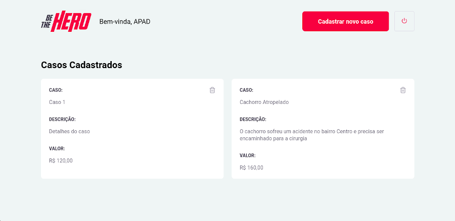

<!-- então bora codar! -->

<h1 align="center">
    
</h1>

<h3 align="center"> A principal missão da aplicação é conectar ONGS a hérois dispostos a salvar o dia! </h3>


<p align="center">  </p>

<p align="center">  

---

A 11ª edição da Semana OmniStack, ocorrida entre 23/03 e 27/03, trouxe como projeto uma aplicação completa e o desafio foi lançado: Criar uma aplicação do zero ao 100% em apenas uma semana usando as principais stacks Javacript, incluindo todo os aspectos de backend front end e o mobile com React native.

### Tecnologias usadas
Esse projeto foi desenvolvido com as seguintes tecnologias:
- [Node.js](https://nodejs.org/en/)
- [Expo](https://expo.io/)
- [Express](https://expressjs.com/pt-br/)
- [React](https://pt-br.reactjs.org/)
- [React Native](https://reactnative.dev)

Extras:

- Main Libs
  - [Express](https://expressjs.com/pt-br/)
  - [KnexJS](http://knexjs.org/)
  

  
###


### ⚙ Como executar este projeto

Podemos considerar este projeto como sendo divido em três partes:

1. Backend
2. Frontend
3. Mobile


### Pré-requisitos

Ferramentas necessárias:

<b>[Git](https://git-scm.com)</b>

<b>[Node.js](https://nodejs.org/en/)</b>

<b>[Expo](https://expo.io)</b>


### 🧭 Como executar o Backend

```bash
# Clone este repositório
$ git clone https://github.com/rossignolli/projeto-be-hero

# Acesse a pasta do projeto no terminal/cmd
$ cd be-the-hero

# Vá para a pasta Backend
$ cd backend

# Instale as dependências
$ npm install ou yarn add

# Execute a aplicação em modo de desenvolvimento
$ npm run dev ou yarn dev

# O servidor inciará na porta:3333 - acesse http://localhost:3333 
```

### 🧭 Como executar o Frontend

```bash
# Clone este repositório
$ git clone https://github.com/rossignolli/projeto-be-hero

# Acesse a pasta do projeto no seu terminal/cmd
$ cd be-the-hero

# Vá para a pasta da aplicação Frontend
$ cd frontend

# Instale as dependências
$ npm install ou yarn add

# Execute a aplicação
$ npm start ou yarn start

# A aplicação será aberta na porta:3000 - acesse http://localhost:3000
```

### 🧭 Como executar o Mobile

```bash
# Clone este repositório
$ git clone https://github.com/rossignolli/projeto-be-hero

# Acesse a pasta do projeto no seu terminal/cmd
$ cd be-the-hero

# Vá para a pasta da aplicação Mobile
$ cd mobile

# Instale as dependências
$ npm install ou yarn add

# Execute a aplicação
$ expo start

```

## Telas

<p align="center">
    
    
    
    
    
    
    
    
    
</p>

### :mortar_board: Quem ministrou?

A semana foi ministrada pelo [Diego Fernandes](https://github.com/diego3g)


### 📱 Minhas redes

Quer conversar?

<p align="center">

  
  <a href="https://instagram.com/cvigarani" target="_blank" >
    </a> 
  
  <a href="https://www.facebook.com/vitor.rossignolli" target="_blank" >
    </a> 

  <a href="https://www.linkedin.com/in/vitor-vigarani-1947a7191//" target="_blank" >
    </a> 
  
  <a href="mailto:vitorrossignolli@gmail.com" target="_blank" >
    </a> 

</p>

Agradecimento ao @ialexanderbrito pelo readme :)

---

Feito com ❤️ by **Vitor :)**
